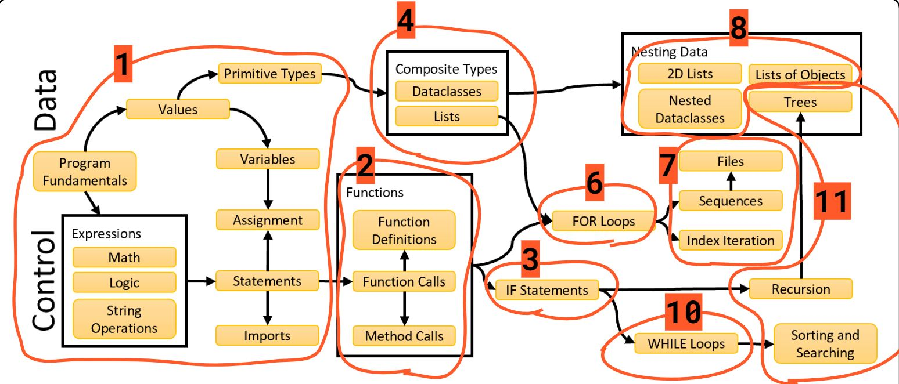
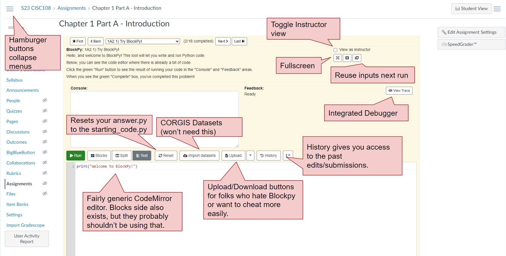

## Overview
Welcome to the University of Delaware CS1 organization. As of 2024, this is the place to collect and manage the resources that go to teaching CISC106 and CISC108. Below is the division of topics covered in the textbook.

These topics, and others, are implemented in the Canvas Learning Management System using the Pedal feedback toolkit, via the ~~BlockPy~~ Prism platform.

## Resources
- [Link to Ella Wilkins projects (which include the spring and fall 2024 CS1 prep boards)](https://github.com/ellawlk?tab=projects)
- [Python Bakery Textbook](https://blockpy.cis.udel.edu/assignments/textbook/bakery_textbook)
- [Python Bakery Issue Tracker](https://github.com/python-bakery/bakery-curriculum/issues)
- [Pedal repository](https://pedal-edu.github.io/pedal/)

# ToDo
- [x] Add intro to the org
- [x] Add collection of related resources.

<!--

**Here are some ideas to get you started:**

🙋‍♀️ A short introduction - what is your organization all about?
🌈 Contribution guidelines - how can the community get involved?
👩‍💻 Useful resources - where can the community find your docs? Is there anything else the community should know?
🍿 Fun facts - what does your team eat for breakfast?
🧙 Remember, you can do mighty things with the power of [Markdown](https://docs.github.com/github/writing-on-github/getting-started-with-writing-and-formatting-on-github/basic-writing-and-formatting-syntax)
-->
